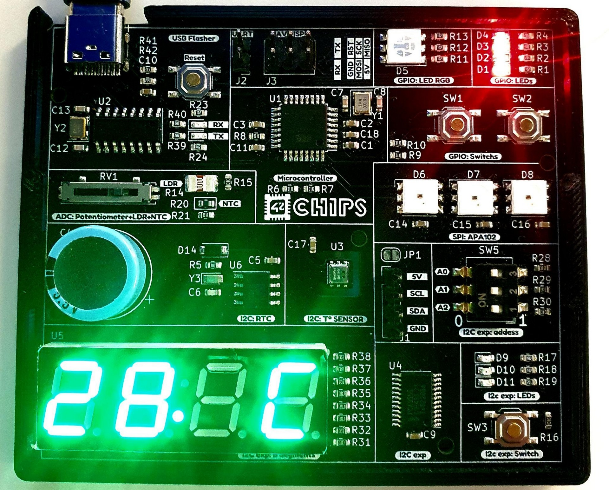

# Bootcamp embedded development

Development on **atmega328p**: 8-bit AVR microcontroller.

A walk through interrupts, timers, adc, eeprom and **communication protocols**: uart, i2c, spi.

Readings of [datasheets](https://ww1.microchip.com/downloads/en/DeviceDoc/Atmel-7810-Automotive-Microcontrollers-ATmega328P_Datasheet.pdf) and schematics.

Communication with peripherals:
- SPI RGB LEDs
- I2C temperature and humidity sensor
- I2C Real Time Clock
- I2C 16-Bit l/0 Expander
- I2C LED screen

---

The end project is about developing a **firmware**:

The program has several modes to display different things on the 7-segment (led screen). When you press SW1, you go to the next mode. When you press SW2, you go to the previous mode. After the last mode, we return to the first. LEDs D1-D4 display in binary the mode in which we are currently.

Here's what each mode does:\
• 0: Displays the ADC value of RV1 in decimal (0 to 1023).\
• 1: Displays the value of the ADC connected to the LDR R14 in decimal (0 to 1023).\
• 2: Displays the value of the ADC connected to the NTC R20 in decimal (0 to 1023).\
• 3: Displays the MCU internal temperature value in decimal (0 to 1023).\
• 4: Displays "-42-" and causes LEDs D5, D6, D7, D8 to flash red, then green, then blue (1 second between each color)\
• 5: Displays the ambient temperature in Celsius.\
• 6: Displays room temperature in Fahrenheit.\
• 7: Displays humidity in percent.\
• 8: Displays the time in 24 hour format (23:23).\
• 9: Displays the day and month.\
• 10: Displays the year.

It must be possible to set the date and time via the serial port. By sending for example: "28/02/2023 18:03:17"

Code is available [here](https://github.com/Jibus22/bootcamp_embedded/blob/3d3291c0eef764e12ac42b66eab7af3d7f488965/rush01/ex00/main.c)

---

_The 42Chips devboard_
